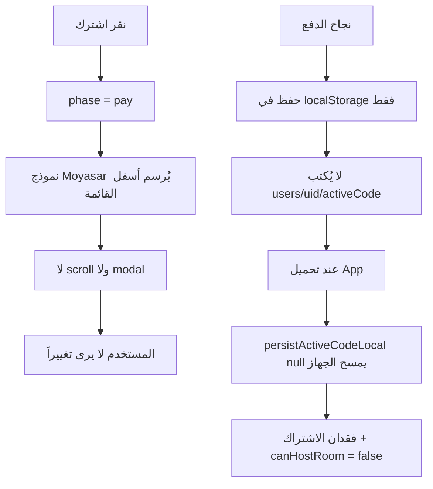
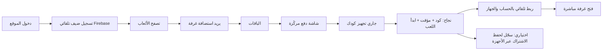

# خطة تحسين تجربة الدفع والاشتراك

## التشخيص — لماذا يبدو أن «لا شيء يحدث»؟



**مشاكل مؤكدة من الكود:**

1. **UX الباقات** — في [`src/pages/Packages.jsx`](src/pages/Packages.jsx) عند `phase === 'pay'` تبقى قائمة الباقات الثلاث ظاهرة والنموذج في الأسفل ([`pkg-moyasar-wrap`](src/styles/packages.css)) بدون `scrollIntoView` ولا modal — يفسر صورتك «انزل شوي القى».

2. **تباسُ الباقة** — الصورة تُظهر باقة 35 ر.س في الأعلى ونموذج «لمسة سريعة 9 ر.س» في الأسفل؛ لأن وضع `pay` لا يخفي الباقات الأخرى ولا يعرض checkout مركزاً للباقة المختارة فقط.

3. **الضيف بعد الدفع** — [`Packages.jsx`](src/pages/Packages.jsx) يكتب `localStorage` مباشرة لكن **لا يفعّل الكود على Firebase** ولا يحدّث `activeCode` في [`App.jsx`](src/App.jsx).

4. **خلل حرج** — في [`App.jsx`](src/App.jsx) سطر ~181-184: إذا `getActiveUserCode` يرجع `null` يُستدعى `persistActiveCodeLocal(null)` في **يمسح** اشتراك Moyasar من الجهاز. و[`persistActiveCodeLocal`](src/core/sessionStats.js) لا يحفظ أصلاً `expiresAt` / `activatedAt`.

5. **فجوة canHostRoom** — `canHostRoom` يعتمد على `activeCode` من Firebase فقط، بينما الألعاب تقرأ `readHostSubscriptionMeta()` من localStorage — سلوك غير متسق بعد الدفع.

6. **حسابي** — [`AccountSubscriptionPanel`](src/shared/AccountSubscriptionPanel.jsx) يقرأ من `users/{uid}/activeCode` و`subscriptionHistory`؛ دفع Moyasar الحالي لا يكتب هناك، فلا يظهر الكود ولا سجل العملية.

7. **صيغة الكود** — أكواد Moyasar `PLAY-XXXX-XXXX` ([`api/activateCode.js`](api/activateCode.js)) بينما التفعيل اليدوي يقبل فقط `CODE-XXXXXX` ([`firebaseHelpers.js`](src/core/firebaseHelpers.js)) — لا يمكن للمستخدم إعادة إدخال كود الشراء يدوياً.

---

## الرؤية المقترحة (معيار مواقع عالمية)



| نوع المستخدم | ماذا يحدث بعد الدفع | أين يرى التفاصيل |
|---|---|---|
| **ضيف (لم يسجّل)** | الكود يُفعّل فوراً على نفس الجهاز حتى `expiresAt` | شاشة النجاح + مؤقت بالهيدر + تبويب «حسابي → الاشتراك» |
| **مسجّل / سجّل لاحقاً** | نفس الشيء + يُحفظ في Firebase | حسابي: كود، مدة، سجل العمليات، رقم العملية |

**مبدأ:** الدفع = تفعيل فوري بدون خطوة «أدخل الكود يدوياً». التسجيل **اختياري** للضيف (للحفظ عبر الأجهزة)، وليس شرطاً للعب.

---

## المرحلة 1 — UX الباقات والدفع (سريعة، تأثير فوري)

**الملفات:** [`src/pages/Packages.jsx`](src/pages/Packages.jsx), [`src/styles/packages.css`](src/styles/packages.css), مكوّن جديد `src/components/codes/PackageCheckout.jsx`

**التغيير:**
- عند النقر على «اشترك» → `phase = 'checkout'` (وليس `pay` مع القائمة).
- **إخفاء** قائمة الباقات بالكامل؛ عرض:
  - ملخص الباقة المختارة (اسم، مدة، سعر، مزايا مختصرة)
  - نموذج Moyasar
  - زر «رجوع لاختيار باقة أخرى»
- `scrollTo({ top: 0 })` + انتقال CSS خفيف (fade/slide).
- تمييز الباقة المختارة قبل الانتقال (حلقة/ظل على البطاقة لـ 300ms) كتغذية راجعة فورية.
- عند تغيير الباقة: تدمير نموذج Moyasar السابق (`innerHTML = ''`) وإعادة `init` — يمنع خلط 9 ر.س مع 35 ر.س.

**البديل المرفوض:** modal فوق القائمة — مقبول لكن checkout كامل الشاشة أنسب للجوال (مثل Stripe / App Store) وأوضح للعربية RTL.

---

## المرحلة 2 — ربط الكود تلقائياً بعد الدفع (الأهم للثقة)

**الملفات:** [`api/activateCode.js`](api/activateCode.js), [`src/pages/Packages.jsx`](src/pages/Packages.jsx), [`src/core/sessionStats.js`](src/core/sessionStats.js), [`src/App.jsx`](src/App.jsx)

### 2أ — توسيع API
بعد إنشاء الكود في [`api/activateCode.js`](api/activateCode.js):
- قبول `idToken` اختياري (Firebase Admin `verifyIdToken`).
- كتابة بنية متوافقة مع النظام الحالي:
  - `users/{uid}/activeCode` — كود، `expiresAt`، `activatedAt`، `duration`/`planDays`
  - `users/{uid}/subscriptionHistory/{key}` — `paymentId`، المبلغ، اسم الباقة، `source: 'moyasar'`
  - `codes/{codeId}` — `status: 'active'`، `userId`، `expiresAt` (توحيد مع أكواد `CODE-`)
- عند `duplicate` / `recovered`: إرجاع الكود **و** بيانات المستخدم إن وُجدت.

### 2ب — العميل بعد النجاح
في [`Packages.jsx`](src/pages/Packages.jsx):
- إرسال `idToken` من `auth.currentUser` مع طلب التفعيل.
- استدعاء callback جديد `onSubscriptionActivated(codeData)` يُمرَّر من [`App.jsx`](src/App.jsx) لتحديث `activeCode` فوراً (بدون انتظار reload).
- استخدام `persistActiveCodeLocal` الموحّد بدل `localStorage.setItem` المباشر.

### 2ج — إصلاح مسح الجهاز
في [`App.jsx`](src/App.jsx) bootstrap:
```javascript
// ترتيب الأولوية: Firebase activeCode → localStorage صالح → null
const firebaseCode = await getActiveUserCode(user.uid);
const localCode = readLocalSubscription(); // دالة جديدة تقرأ expiresAt
let validCode = pickValid(firebaseCode, localCode);
if (localCode && !firebaseCode) { trySyncToFirebase(localCode); } // محاولة ربط
setActiveCode(validCode);
persistActiveCodeLocal(validCode); // يحفظ expiresAt + activatedAt
```
**لا** تستدعِ `persistActiveCodeLocal(null)` إذا كان هناك اشتراك محلي صالح.

### 2د — `persistActiveCodeLocal`
توسيع [`sessionStats.js`](src/core/sessionStats.js) لحفظ: `expiresAt`, `activatedAt`, `duration`, `paymentId` — مطلوب لـ [`readHostSubscriptionMeta`](src/core/roomLifecycle.js) و[`SubscriptionTimer`](src/components/codes/SubscriptionTimer.jsx).

---

## المرحلة 3 — شاشة النجاح و«حسابي»

**الملفات:** [`src/pages/Packages.jsx`](src/pages/Packages.jsx), [`src/shared/AccountSubscriptionPanel.jsx`](src/shared/AccountSubscriptionPanel.jsx), مكوّن جديد `src/components/codes/PaymentHistoryRow.jsx`

### شاشة النجاح (بعد الدفع)
- الكود بخط كبير + نسخ بنقرة
- العد التنازلي «صالح حتى...»
- زر أساسي: **«ابدأ اللعب الآن»** → `onBack` + `setTab('game')`
- زر ثانوي للضيف: **«احفظ اشتراكك — سجّل مجاناً»** → تبويب حسابي
- لا إغلاق تلقائي — المستخدم يرى الكود بوضوح

### حسابي — تبويب الاشتراك
- إذا نشط: يظهر الكود + المؤقت (موجود في [`AccountSubscriptionPanel`](src/shared/AccountSubscriptionPanel.jsx))
- **جديد:** قسم «آخر عمليات الشراء» يعرض من `subscriptionHistory` حيث `source === 'moyasar'`:
  - التاريخ، الباقة، المبلغ، رقم العملية (مختصر)، حالة «مفعّل»

---

## المرحلة 4 — دعم صيغة PLAY- (احتياطي)

**الملف:** [`src/core/firebaseHelpers.js`](src/core/firebaseHelpers.js)

- توسيع `normalizeSubscriptionCode` لقبول `PLAY-XXXX-XXXX`.
- في `activateCodeClient`: البحث بمفتاح `codes/{codeId}` إذا لم يُوجد في `codeIndex`.
- يضمن أن الضيف الذي فقد الجلسة يمكنه إعادة إدخال كود الشراء يدوياً.

---

## ترتيب التنفيذ المقترح

| الأولوية | المهمة | السبب |
|---|---|---|
| 1 | Checkout مركّز + scroll | يحل «ما يظهر شيء» فوراً |
| 2 | إصلاح مسح localStorage في App | يمنع فقدان الاشتراك على الجهاز |
| 3 | ربط API + idToken + onSubscriptionActivated | تفعيل فوري + canHostRoom |
| 4 | شاشة نجاح + سجل عمليات في حسابي | ثقة المستخدم |
| 5 | دعم PLAY- يدوياً | شبكة أمان |

---

## ما لن نفعله الآن (تعقيد غير ضروري)

- إرسال الكود بالبريد/SMS (يتطلب جمع email قبل الدفع — يبطئ التحويل).
- ربط Moyasar webhooks منفصلة (الـ API الحالي + retry كافٍ للبداية).
- اشتراك متعدد الأجهزة بدون تسجيل (يبقى جهاز واحد للضيف — معيار SaaS معقول).

---

## معايير النجاح (قبل الإطلاق)

1. نقر «اشترك» → خلال 0.5 ثانية المستخدم يرى شاشة دفع واضحة بدون scroll يدوي.
2. بعد 3DS ناجح → كود خلال ≤15 ثانية على شاشة مخصصة.
3. «ابدأ اللعب» → يستطيع إنشاء غرفة مباشرة (`canHostRoom === true`).
4. تحديث الصفحة → الاشتراك يبقى فعالاً على نفس الجهاز.
5. حسابي → يظهر الكود + عملية الشراء للمسجّل.
6. الضيف بدون تسجيل → يلعب حتى انتهاء المدة على نفس الجهاز.
