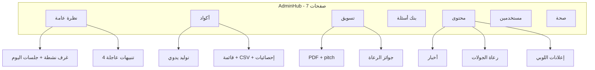
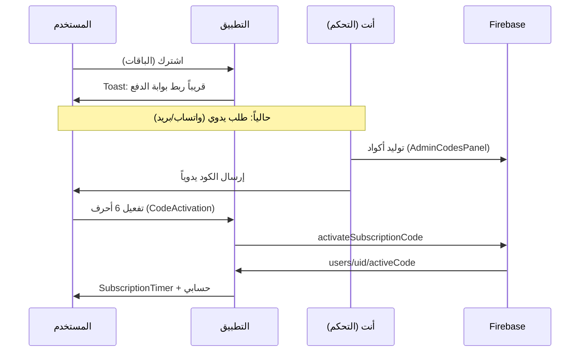
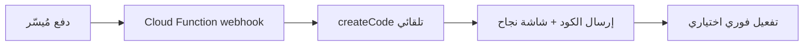
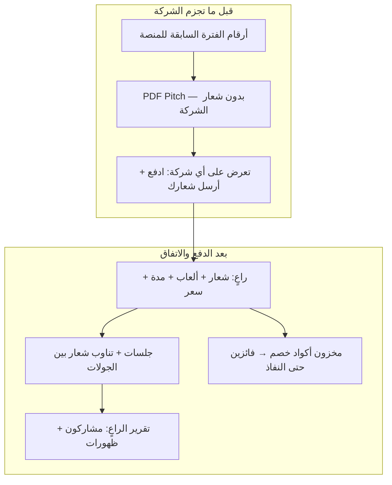
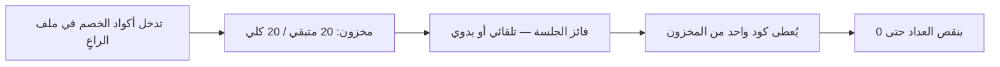
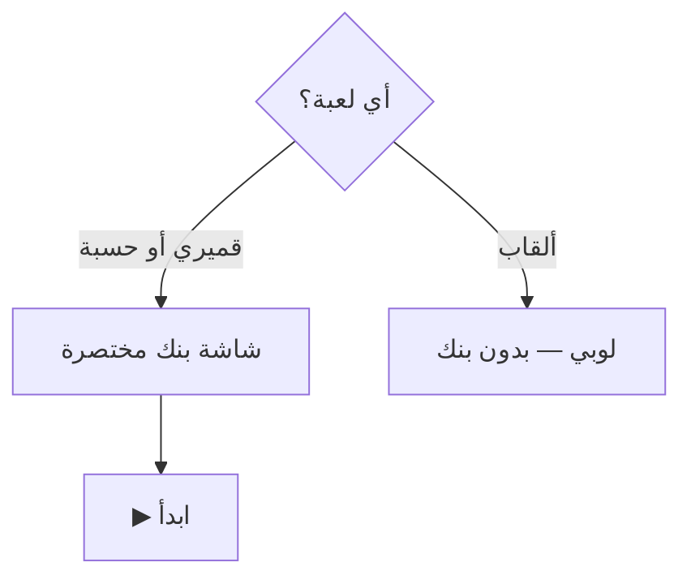
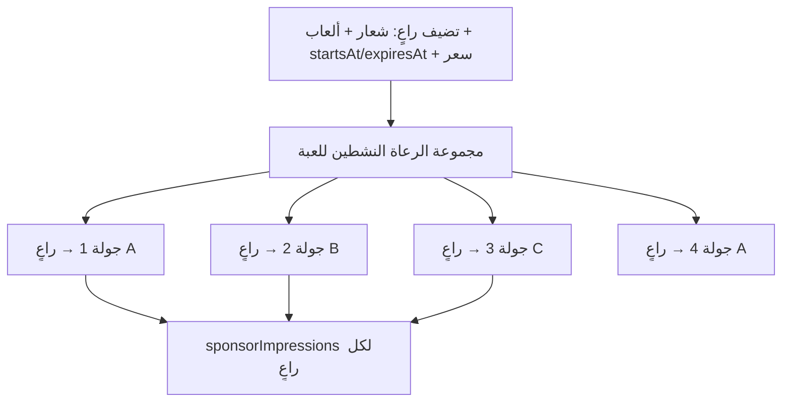
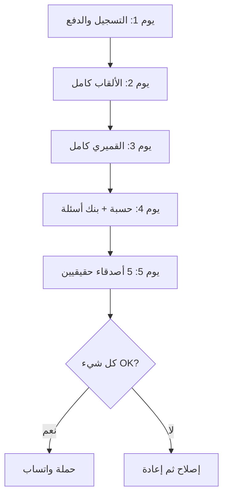

# رؤية شاملة: مركز التحكم وساحة الألعاب قبل الإطلاق

## الوضع الحالي باختصار

مركز التحكم ([`AdminHub.jsx`](src/components/admin/AdminHub.jsx)) منظم في **7 صفحات** بدون React Router — التنقل عبر حالة `page` محلية. الأقسام **وظيفياً مكتملة** لكن **عرضها وترتيبها** و**بعض الفجوات الحرجة** (خصوصاً الدفع) تحتاج تطوير قبل الإطلاق.



---

## 1. النظرة العامة — ما موجود وما ينقص

### ما يُعرض الآن
- [`AdminAlertsStrip`](src/components/admin/AdminAlertsStrip.jsx): اقتراحات جديدة، أكواد تنتهي خلال 48 ساعة، غرف عالقة، جلسات مؤهلة للجوائز — **قابل للنقر** للانتقال للقسم المناسب.
- [`AdminPulsePanel`](src/components/admin/AdminPulsePanel.jsx): غرف نشطة (حتى 12)، جلسات آخر 24 ساعة، تفصيل حسب اللعبة.

### ما **لا** يظهر (وهذا سبب إحساسك أن «مو كل شيء موجود»)
| المؤشر | الحالة |
|--------|--------|
| إجمالي المشرفين / حاضرون / غائبون | موجود في «مستخدمين» فقط |
| أكواد اشتراك: مجاني vs مدفوع vs نشط vs منتهي | **مقصود يبقى في «أكواد» فقط** — لا يظهر في الباقات أو واجهة المستخدم |
| إيرادات تقريبية | غير محسوب |
| عدد أسئلة البنك (183) | غير ظاهر |
| ملخص تسويقي B2B | موجود في «تسويق» فقط |
| صحة المنصة (غرف يتيمة، أحداث أمنية) | موجود في «صحة» فقط |
| إجراءات سريعة (توليد كود، PDF، صيانة) | غير موجودة |

### التطوير المقترح — لوحة «Command Center» حقيقية
إعادة تصميم صفحة **نظرة عامة** كـ **شبكة KPI + إجراءات سريعة**:

```
┌─────────────────────────────────────────────────────┐
│  تنبيهات عاجلة (موجود — يُحسَّن التصميم)           │
├──────────┬──────────┬──────────┬──────────┬──────────┤
│ غرف الآن │ جلسات    │ مشرفون   │ أكواد    │ أسئلة    │
│          │ اليوم    │ نشطون    │ نشطة     │ البنك    │
├──────────┴──────────┴──────────┴──────────┴──────────┤
│  إجراءات سريعة: [توليد كود مدفوع] [توليد كود ترويجي] [PDF راعي] │
├─────────────────────────────────────────────────────┤
│  غرف مباشرة (موجود)  │  آخر 5 جلسات مكتملة        │
└─────────────────────────────────────────────────────┘
```

**الأولوية:** متوسطة-عالية — يحسّن تجربتك اليومية كمشرف منصة، لكن لا يمنع الإطلاق.

---

## 2. الأكواد — آلية الشراء، الظهور، المجانية، والباقات

### كيف يعمل **الآن** (بدون مُيسّر)



**بعد التفعيل** يظهر الكود للمستخدم في:
1. [`SubscriptionTimer`](src/components/codes/SubscriptionTimer.jsx) — شارة الهيدر
2. [`AccountSubscriptionPanel`](src/shared/AccountSubscriptionPanel.jsx) — صفحة «حسابي» (الكود + العدّ التنازلي)
3. `users/{uid}/activeCode` في Firebase

**لا يوجد** مسار «دفع → كود تلقائي» — هذه **أهم فجوة** قبل الإطلاق.

### الأكواد الترويجية (المجانية) — سياسة التوزيع

**أتفق معك تماماً.** الأكواد المجانية/الترويجية **أداة اكتساب وليست منتجاً للبيع** — وجودها **حصرياً في شاشة «أكواد»** في مركز التحكم. أنت تولّدها وتوزّعها بطريقتك، والمستخدم يرى فقط شاشة التفعيل العادية (ما فيه «باقة مجانية» أو زر خاص).

**حالات الاستخدام المتفق عليها:**
- **الأهل والأصدقاء** — حملة الواتساب الأولى، تجربة المنصة بدون حاجز دفع
- **محلات محلية (B2B خفيف)** — أكواد تُعطى زبائن المحل كـ **add value** («مع مشترياتك جلسة ألعاب مجانية») → المحل يكسب ولاء، وأنت تكسب **وعي بالمنصة**
- **استهداف أولي** — محل واحد أو اثنين في البداية، قياس: كم فعّل، كم استضاف، كم عاد للشراء

**ما لا نفعله:**
- لا باقة «مجاني» في صفحة [`Packages.jsx`](src/pages/Packages.jsx)
- لا ظهور في النظرة العامة أو التسويق كعرض عام
- لا احتساب ضمن الإيرادات أو تقارير B2B للراعي

**التنفيذ التقني (في [`AdminCodesPanel`](src/components/admin/AdminCodesPanel.jsx) فقط):**
- حقل `source: 'paid' | 'promo'` (+ اختياري `promoNote`: «محل X» / «عائلة»)
- زر **«توليد أكواد ترويجية»** منفصل عن المدفوعة (`price: 0`)
- إحصائيات داخل نفس الشاشة: **X ترويجي · Y مدفوع · Z نشط**
- فلتر: ترويجي / مدفوع
- **مدة الترويج المعتمدة: 6 ساعات** — كافية لجلسة تجريبية واحدة (ألقاب أو قميري)، ما تُنافس باقة «لمسة سريعة» (24 ساعة مدفوعة)
- **تقنياً:** النظام حالياً يحسب المدة بالأيام فقط — يُضاف دعم `durationHours: 6` للأكواد الترويجية (أو `durationUnit: 'hours'`)

[`createCode`](src/core/firebaseHelpers.js) حالياً يحفظ `duration` و `price` فقط — يُضاف `source` و `promoNote` بدون تغيير تجربة المستخدم.

### الباقات الثلاث — هل هي مناسبة؟

| الباقة | المدة | سعر العرض | التقييم |
|--------|-------|-----------|---------|
| لمسة سريعة | 24 ساعة | 9 ر.س | ممتازة للتجربة الأولى |
| جمعة اللمة | 3 أيام | 18 ر.س | **الأفضل للإطلاق** — عطلة نهاية أسبوع |
| أسبوع البطولة | 7 أيام | 35 ر.س | جيدة للمستخدم المتكرر |

**التوصية:** الباقات الثلاث **مناسبة للإطلاق** — لا تُضف رابعة الآن (تشتت). الأكواد الترويجية **من شاشة الأكواد فقط** (**6 ساعات** ثابتة) — للأهل والأصدقاء ومحلات add value، **لا تُعدّ باقة رسمية**.

### بعد ربط مُيسّر (الضروري)



**ملفات للتعديل:** [`App.jsx`](src/App.jsx) (إزالة Toast «قريباً»)، [`Packages.jsx`](src/pages/Packages.jsx)، Cloud Function جديدة `onPaymentSuccess`.

---

## 3. التسويق — ماذا بُني وماذا يمكن تطويره

### ما بُني فعلاً

| المكوّن | الوظيفة |
|---------|---------|
| [`AdminPlatformMarketing`](src/components/admin/AdminPlatformMarketing.jsx) | ملخص B2B: مشاركات، ذروة حضور، جولات رعاية، دقائق تفاعل |
| [`MarketingReportDialog`](src/components/admin/MarketingReportDialog.jsx) + [`marketingImpactReport.js`](src/core/marketingImpactReport.js) | تقرير PDF عبر **طباعة المتصفح** (حفظ كـ PDF) |
| [`AdminPrizePanel`](src/components/admin/AdminPrizePanel.jsx) | جلسات مؤهلة (5+ لاعبين، 2+ جولة) → تسجيل فائز → شهادة PDF |
| [`AdminSponsorsManager`](src/components/admin/AdminSponsorsManager.jsx) | CRUD رعاة + تقرير تأثير لكل راعٍ |
| [`CodeSponsorLink`](src/components/admin/CodeSponsorLink.jsx) | ربط راعٍ بكود اشتراك |
| [`AdminCodesPanel`](src/components/admin/AdminCodesPanel.jsx) | تصدير CSV تسويقي |

### رؤية B2B — مرحلتان: قبل الاشتراك + بعد الدفع



---

#### المرحلة 1 — **قبل الاشتراك** (Pitch للشركات المحتملة)

**الهدف:** أي شركة **قبل ما تدفع** تشوف **أرقام الفترة السابقة** للمنصة — عشان تقرر وتتفاوض.

| ماذا تعرض | المصدر |
|-----------|--------|
| إجمالي المشرفين / الجلسات / المشاركين | `aggregateMarketingMetrics` |
| ذروة الحضور + متوسط اللاعبين/جلسة | stats مجمّعة |
| جولات + دقائق تفاعل + ظهورات رعاية (عام) | المنصة ككل |
| تفصيل حسب اللعبة | titles / fameeri / hesbah |

**من أين:** **التسويق** → «تقرير Pitch للراعي المحتمل» (PDF بدون شعار شركة — أرقام المنصة فقط + عرض الباقات).

**الرسالة للشركة:** «هذي أرقامنا — إذا حاب تعلن: تدفع + ترسل شعارك + نحدد مدة ولعبة + نعطيك تقرير بعد كل فترة».

---

#### المرحلة 2 — **بعد الدفع** (ما يهم الشركة الراعية)

**تضيف الراعٍ:** شعار + ألعاب + `startsAt`/`expiresAt` + `contractPrice` + (اختياري) **مخزون أكواد خصم**.

**أثناء العقد — ما يهمها:**

| المقياس | المعنى |
|---------|--------|
| **عدد المتسابقين** | `totalPlayerCount` — كل من لعب في جلسات ظهر فيها شعارها |
| **المتواجدون / شاهدوا الإعلان** | `roundReach` + `sponsorImpressions` — جولة × لاعبين |
| **الجولات + الدقائق** | `totalRounds` + `totalEngagementMinutes` |
| **ذروة حضور** | `peakPlayers` — أعلى غرفة |

**التقرير:** **التسويق** → الراعٍ → «إصدار تقرير» — **بأي وقت** خلال أو بعد العقد.

---

#### أكواد خصم الفائزين — مخزون ينفاد (جديد — غير موجود)

**الاتفاق:** الشركة تتكفل بـ **X كود خصم/هدية** — عدد يُتفق عليه (مثلاً 20 كود، كود لكل فائز).

**الآلية المطلوبة:**



| الحقل (على الراعٍ) | الوظيفة |
|---------------------|---------|
| `couponPoolTotal` | العدد المتفق (مثلاً 20) |
| `couponPoolRemaining` | المتبقي |
| `couponCodes[]` | قائمة الأكواد (أو CSV import) |
| `autoAwardWinner` | `true` = الفائز يحصل تلقائياً عند انتهاء اللعبة |
| `prizeOffer` | وصف العرض («خصم 20% — كود XYZ») |

**التدفق:**
1. **قبل البدء:** إذا اتُفق على خصم/هدية → تُدخل الأكواد + العدد في [`AdminSponsorsManager`](src/components/admin/AdminSponsorsManager.jsx)
2. **بعد الجلسة:** الفائز → **شهادة فاخرة** (دائماً) + **كود خصم** (فقط إن بقي مخزون)
3. **حتى النفاذ:** `couponPoolRemaining = 0` → شهادة **بدون** كود — الفائز ما يشوف أي هدية/خصم
4. **بدون اتفاق خصم:** رعاية شعار فقط — شهادة فوز بدون قسم الجائزة

**قاعدة العرض للفائز:**

| الحالة | الشهادة | كود الخصم/الهدية |
|--------|---------|-------------------|
| راعٍ + مخزون متبقي | ✅ تظهر | ✅ يُسحب كود ويظهر على الشهادة |
| راعٍ + المخزون خلص | ✅ تظهر | ❌ **لا يظهر شيء** — شهادة فوز فقط |
| راعٍ بدون اتفاق هداia | ✅ تظهر | ❌ لا قسم جائزة |
| بدون راعٍ | ✅ شهادة المنصة فقط | ❌ |

---

#### شهادة الفائز — تصميم فاخر رسمي (متفق عليها)

**الهدف:** وثيقة **يليق بها المنصة** — الفائز + الراعي + أنت تستفيدون منها PR.

**محتوى الشهادة:**

| العنصر | المصدر |
|--------|--------|
| **شعار لعيب زون** | [`reportBrandAssets`](src/shared/reportBrandAssets.js) |
| **شعار الشركة الراعية** | `sponsorLogoUrl` |
| **اسم الفائز/الفائزة** | نتيجة اللعبة تلقائياً |
| **تفاصيل اللعبة** | اسم اللعبة، الغرفة، التاريخ، عدد الجولات، عدد المتسابقين |
| **برعاية [الشركة]** | `sponsorName` + tagline |
| **كود الخصم/الهدية** | **فقط** إن `couponPoolRemaining > 0` واتُفق |
| **رقم الشهادة** | `PRZ-{id}` — رسمي للتوثيق |

**التصميم المطلوب** (تطوير [`prizeCertificateReport.js`](src/core/prizeCertificateReport.js) — **موجود بسيط اليوم**):

- إطار ذهبي/عنابي يليق بهوية المنصة — **فخم، رسمي، A4**
- شعاران متقابلان في الأعلى: **لعيب زون** | **الراعي**
- اسم الفائز بخط بارز في الوسط
- تفاصيل الجلسة بجدول أنيق
- قسم «🎁 جائزة الراعي» **يُخفى بالكامل** إذا ما فيه كود أو انتهى المخزون
- تذييل: بيانات المنصة القانونية + رقم الشهادة

**أين تظهر للفائز:**

1. **شاشة النتائج** داخل اللعبة (ألقاب / قميري / حسبة) — معاينة + «تحميل PDF»
2. **لوحة الجوائز** ([`AdminPrizePanel`](src/components/admin/AdminPrizePanel.jsx)) — إصدار PDF للأرشفة

**الحالة الحالية:** شهادة PDF **بسيطة** من الأدمن فقط — **لا تظهر تلقائياً للفائز** في اللعبة، و**لا تخفي** قسم الجائزة عند نفاد المخزون. **يُعاد تصميمها بالكامل.**

**الحالة الحالية (المخزون):** [`prizeOffer`](src/core/platformSponsors.js) **نص فقط** — [`AdminPrizePanel`](src/components/admin/AdminPrizePanel.jsx) يحدّد الفائز **يدوياً**. **يُبنى من الصفر.**

---

#### إعداد الراعي (حسب الاتفاق)

في [`AdminSponsorsManager`](src/components/admin/AdminSponsorsManager.jsx):

| الحقل | الحالة |
|-------|--------|
| شعار + ألعاب + مدة + سعر | ✅ جزئياً — يُكمَّل `contractPrice` |
| مخزون أكواد خصم | ❌ جديد |
| تناوب بين الجولات | ❌ يُطوَّر في `SponsorRoundBadge` |

#### الجلسات والإحصائيات

- **الكود** = اشتراك المشرف · **الراعي** = مدة + تناوب جولات
- كل ظهور → `sponsorImpressions[sponsorId]`
- **ربط كود حصري** = اختياري (مرحلة 2)

#### أثناء اللعب

[`SponsorRoundBadge`](src/shared/SponsorRoundBadge.jsx): تناوب round-robin بين الرعاة النشطين.  
[`sessionStats.js`](src/core/sessionStats.js) يجمع:

| المقياس | المعنى للشركة |
|---------|----------------|
| `totalPlayerCount` | إجمالي المشاركين في الغرف |
| `peakPlayers` | أعلى عدد متواجدين بجلسة واحدة |
| `totalEngagementMinutes` | **المدة المنقضية باللعبة** (دقائق تفاعل) |
| `totalRounds` | **كم جولة** وصلوا |
| `roundReach` | **كم مرة ظهر الإعلان** (جولة × لاعبين) |
| `sponsorImpressions` | ظهورات مرتبطة براعٍ محدد |
| `completionRate` | نسبة إكمال الجلسات |
| `byGame` | تفصيل لكل لعبة (ألقاب / قميري / حسبة) |

#### التقارير — نوعان

| التقرير | متى | من أين |
|---------|-----|--------|
| **Pitch (قبل الاشتراك)** | تعرض على شركة محتملة | **التسويق** → أرقام المنصة للفترة السابقة |
| **تقرير الراعٍ (بعد الدفع)** | خلال/بعد العقد | **التسويق** → الراعٍ → إصدار PDF |

**محتوى تقرير الراعٍ (بعد الدفع):**

1. غلاف + شعار الشركة + فترة العقد + المبلغ
2. **متسابقون** + **متواجدون شاهدوا الإعلان** (ظهورات) — أبرز KPI
3. جولات + دقائق تفاعل + ذروة حضور + تفصيل ألعاب
4. **أكواد الخصم:** مُسلّمة / متبقية من المخزون
5. ROI + pitch تجديد

**يُجمع اليوم:** مشاركون، ظهورات، جولات، دقائق — **ينقص:** pitch منفصل، مخزون كوبونات، تسليم آلي للفائز.

### ما ينقص (حسب رؤيتك)

1. **تقرير Pitch** — أرقام الفترة السابقة قبل ما الشركة تدفع
2. **`contractPrice`** + **`couponPool`** (مخزون أكواد خصم ينفاد)
3. **شهادة فاخرة** للفائز (شعارنا + الراعي + اسم + تفاصيل) — كود يظهر **فقط** إن بقي مخزون
4. **تناوب round-robin** بين الرعاة + `sponsorImpressions` per-round
5. **تقرير PDF أغنى** — إبراز «شاهدوا إعلانك» + أكواد مُسلّمة/متبقية
6. **شاشة نتائج اللعبة** — معاينة الشهادة للفائز تلقائياً
7. **ربط كود حصري** — اختياري (مرحلة 2)

**الأولوية:** **عالية** — قلب عرضك على الشركات قبل أول راعٍ حقيقي.

---

## 4. بنك الأسئلة — 183 سؤال والطريق إلى 1000

### Pagination — **الآن** (لا ننتظر زيادة الأسئلة)

**183 سؤال اليوم = صفحة طويلة ومزعجة** — Pagination **مطلوب فوراً**، مو «لما نوصل 500».

**التنفيذ في [`QBankManager.jsx`](src/question-bank/QBankManager.jsx):**

| الميزة | التفاصيل |
|--------|----------|
| **عدد لكل صفحة** | خيارات: **20 · 30 · 50 · 100** (افتراضي **30**) |
| **تنقل** | أول · سابق · رقم الصفحة · تالي · آخر |
| **البحث + Pagination** | **البحث يمسح كل البنك** (183+) — ثم يقسم **نتائج البحث** لصفحات (انظر توضيح أدناه) |
| **عداد** | «عرض 31–60 من 183 سؤال» |
| **حفظ التفضيل** | `localStorage` — يتذكر 20/30/50/100 |

**لماذا 20 / 30 / 50 / 100؟**
- **20** — جوال، مراجعة سريعة
- **30** — **افتراضي** — توازن مريح
- **50** — شاشة أكبر، تحرير دفعات
- **100** — استيراد/مراجعة جماعية (للمشرف على الكمبيوتر)

**المرحلة 2 (عند 500+):** استعلامات Firebase مفهرسة — Pagination client-side يكفي للإطلاق.

#### توضيح: البحث vs Pagination (ليش ما يتعارضان)

**سؤالك منطقي** — الاثنان يشتغلان مع بعض:

```
1. تكتب كلمة أو جزء سؤال  →  النظام يبحث في **كل** الأسئلة (183+)
2. يطلع مثلاً 47 نتيجة مطابقة
3. Pagination يقسم الـ 47 فقط: صفحة 1 (30) · صفحة 2 (17)
4. العداد: «عرض 1–30 من 47 نتيجة (من 183 إجمالاً)»
```

**يعني:** البحث **ما ينقص** — يبحث الكل زي الحالي. Pagination **بس يمنع** إن 183 (أو 47 نتيجة) تطلع دفعة واحدة طويلة.

---

#### بنك الأسئلة — **قميري + حسبة فقط** (الألقاب خارج البنك)

**قرار واضح:** **الألقاب** = تخمين ألقاب الأشخاص — **لا تستخدم بنك الأسئلة إطلاقاً**.

| اللعبة | البنك | السجل / عدم التكرار |
|--------|-------|---------------------|
| **قميري** | ✅ | ✅ يُكمَّل |
| **حسبة** | ✅ | ✅ موجود |
| **الألقاب** | ❌ **خارج البنك** | — |

**في الأدمن [`QBankManager`](src/question-bank/QBankManager.jsx):** إخفاء خيار «الألقاب» — `QB_GAME_TYPES` = قميري + حسبة + الكل فقط.

---

#### شاشة تجهيز الأسئلة — **واضحة، بدون كلام كثير**

**المشكلة:** شروحات طويلة في [`QuestionSourceSetup`](src/question-bank/QuestionSourceSetup.jsx) — **مزعجة أثناء اللعب**.

**المطلوب (قميري / حسبة فقط):** سطر أرقام + `[ 🆕 جديد ]` + `[ 🔁 إعادة ]` + `[ مسح ]` + `[ ▶ ابدأ ]` — **بدون فقرات**.

- **افتراضي:** جديد فقط — نفس المجموعة = لا تكرار
- **🔁 إعادة:** اختياري — مجموعة مختلفة
- **♻️ مسح السجل:** يمسح **ذاكرة «ظهر سابقاً»** فقط — كل الأسئلة ترجع «جديدة» (ما يحذف من البنك)
- **الألقاب:** لا تظهر هذه الشاشة

**توضيح «مسح السجل»:**

| | |
|---|---|
| **وش يسجّل النظام؟** | IDs الأسئلة اللي **عرضتها** في جلسات سابقة (نفس التصنيف/الفلتر) |
| **وش يسوي المسح؟** | يصفّر القائمة → «ظهر سابقاً: 0 · جديد: 171» |
| **متى تستخدمه؟** | نفدت الأسئلة الجديدة · أو تبي **تبدأ دورة جديدة** مع نفس المجموعة |
| **وش ما يسويه؟** | **ما يحذف** أسئلة من البنك — بس ينسى إنك استخدمتها قبل |

**فرق سريع:** 🔁 إعادة = يلعب من الأسئلة القديمة **بدون مسح**. ♻️ مسح = **نسيان** كل ما ظهر — ثم «جديد فقط» من الصفر.

**الوضع الحالي:** حسبة ✅ (كلام كثير يُختصر) · قميري ✅ جزئي · ألقاب — **لا بنك**



**في الأدمن:** بحث + تنبيه تكرار نصي — **بدون خيار ألقاب**.

### الوضع الحالي
- فلاتر + بحث: **ممتاز**
- **لا pagination** — كل الأسئلة دفعة واحدة ❌
- **لا صور** — مرحلة 2

### الصور — هل مكلفة؟
| الخيار | التكلفة | التوصية |
|--------|---------|---------|
| URL خارجي | مجاني | للبداية |
| Firebase Storage | ~$0.026/GB + نقل | معقول إذا ضغطت الصور (WebP، max 200KB) |
| base64 في RTDB | يزيد حجم DB | **لا** — مستخدم للرعاة فقط (≤90KB) |

**التوصية:** Pagination **قبل الإطلاق** — صور الأسئلة في **المرحلة 2**.

---

## 5. رعاة الجولات وإعلانات اللوبي — هل لها مكان فعلي؟

### نعم — مربوطة وتظهر

| المحتوى | أين يُدار | أين يظهر |
|---------|-----------|----------|
| رعاة الجولات | [`AdminContentPanel`](src/components/admin/AdminContentPanel.jsx) → رعاة | [`SponsorRoundBadge`](src/shared/SponsorRoundBadge.jsx) داخل **الألقاب، القميري، حسبة** أثناء الجولات (مخفي في lobby/ended) |
| إعلانات اللوبي | نفس الصفحة → لوبي | [`LobbyPromoStrip`](src/shared/LobbyPromoStrip.jsx) في [`Home.jsx`](src/pages/Home.jsx) |

### آلية ظهور الرعاة — بالمدة + تناوب بين الجولات (رؤيتك)

**النموذج الصحيح:** الراعي يُعرَّف بـ **اتفاق + مدة + ألعاب + سعر** — **مو** بالأساس عبر ربط الكود.  
إذا فيه **أكثر من راعٍ نشط** لنفس اللعبة خلال فترة العقد → **كل جولة راعٍ مختلف** (تناوب عادل).



**مثال:** 3 شركات راعية للألقاب لمدة شهر → جولة 1 مقهى A، جولة 2 مطعم B، جولة 3 محل C، جولة 4 يرجع A…

| | النموذج القديم (بالكود) | **رؤيتك (بالمدة + تناوب)** |
|---|---|---|
| من يحدد الراعي؟ | كود المشرف | **الرعاة النشطون** + اللعبة + **رقم الجولة** |
| أكثر من راعٍ | واحد فقط (كود أو منصة) | **تناوب** بين الجميع |
| مدة الظهور | مدة الكود | **مدة العقد** `startsAt` / `expiresAt` |
| الإحصائيات | على الكود | **على كل راعٍ** (`sponsorImpressions`) |

**دور الكود يبقى — لكن مختلف:**
- الكود = **اشتراك المشرف** (يدفع ويستضيف) — مصدر جلسات وإحصائيات عامة
- **ربط كود ↔ راعٍ** = **اختياري** فقط لاتفاق **حصري** («هذا المشرف/الكود لراعٍ واحد فقط»)
- **الافتراضي:** تناوب الرعاة النشطين — بدون ربط كود

**التطوير المطلوب في [`SponsorRoundBadge`](src/shared/SponsorRoundBadge.jsx):**
- استقبال `roundNumber` من اللعبة
- جلب الرعاة النشطين للعبة الحالية (ضمن المدة)
- `pickSponsorForRound(sponsors, gameKey, roundNumber)` — تناوب (round-robin)
- تسجيل ظهور كل جولة في [`sessionStats.js`](src/core/sessionStats.js) → `sponsorImpressions[sponsorId]`

**التقارير:** من **التسويق** → تقرير لكل راعٍ (ظهورات، جولات، مشاركون) — **بدون** الاعتماد على ربط الكود.

### ما يمكن تطويره
- **معاينة live** من الأدمن (كيف يبدو الشعار في اللعبة)
- **جدولة** `startsAt` لإعلانات اللوبي (موجود للرعاة فقط)
- **Carousel** بدل عرض كل الإعلانات دفعة واحدة
- **Analytics:** عدد نقرات CTA في اللوبي
- **محتوى مقترح للإطلاق:** 1–2 إعلان لوبي (ترحيب + «حمّل التطبيق») + 1 راعٍ تجريبي

---

## 6. المستخدمون / المشرفون — التطوير المطلوب

### الوضع ([`AdminUsersPanel`](src/components/admin/AdminUsersPanel.jsx))
- قائمة من **الأكواد المفعّلة** (ليس كل المستخدمين)
- فلاتر: نشط، غائب +30 يوم، تجريبي
- **قراءة فقط** — لا إجراءات

### التطوير المقترح
1. **بحث** بالاسم / البريد / الكود
2. **بطاقة موسّعة:** آخر 3 جلسات، ألعاب مستخدمة، راعٍ مرتبط
3. **إجراءات سريعة:** واتساب تجديد، تمديد يدوي، ملاحظة إدارية
4. **فصل واضح:** «مشرف غرفة» (كود) vs «مشرف منصة» (admins في Firebase)
5. **Pagination** عند نمو القائمة

**الأولوية:** متوسطة — مهم بعد أول 50 مشرف.

---

## 7. الصحة — ترتيب وإبداع

### الوضع ([`AdminHealthPanel`](src/components/admin/AdminHealthPanel.jsx))
- غرف عالقة (+24 ساعة بعد انتهاء اشتراك)
- غرف منتهية + حذف جماعي
- وضع الصيانة + رسالة
- [`AdminSecurityEvents`](src/components/admin/AdminSecurityEvents.jsx): فشل أكواد، حظر تفعيل

### التطوير المقترح — «لوحة صحة» بصرية
```
🟢 المنصة: تعمل
🟡 غرف للمراجعة: 3
🔴 أحداث أمنية (24س): 2
⚙️ الصيانة: معطّلة
📊 RTDB: ~X MB (تقدير)
👥 حد اللاعبين/غرفة: [حقل UI — موجود في الكود بدون واجهة]
```

- إضافة UI لـ `maxPlayersPerRoom` (موجود في [`platformSettings.js`](src/core/platformSettings.js) بدون حقل)
- **أقسام قابلة للطي** بدل قائمة طويلة
- **تصدير CSV** لأحداث الأمان

**الأولوية:** منخفضة-متوسطة قبل الإطلاق — الصيانة اليدوية كافية الآن.

---

## ترتيب الأولويات قبل الإطلاق (بعد وصول رابط مُيسّر)

### 🔴 حرجة — لا تُطلق بدونها

| # | المهمة | السبب |
|---|--------|-------|
| 1 | **ربط مُيسّر end-to-end** | بدونها كل عملية شراء يدوية |
| 2 | **تسليم الكود بعد الدفع** (شاشة + بريد/واتساب) | تجربة المستخدم |
| 3 | **اختبار كامل 3–5 أيام** | تسجيل → دفع → تفعيل → استضافة → 3 ألعاب |
| 4 | **أكواد ترويجية** (شاشة الأكواد فقط) | حملة واتساب + محلات add value |
| 5 | **Firebase blaze + `VITE_SECURITY_MODE=blaze`** | تفعيل آمن عبر Cloud Function |

### 🟡 مهمة — قبل أو مع الإطلاق

| # | المهمة |
|---|--------|
| 6 | تحسين **نظرة عامة** (KPI موحّدة) |
| 7 | **Pagination بنك الأسئلة** (20/30/50/100) | **الآن** — 183 سؤال كافية |
| 8 | تحسين **PDF التسويق** (مشرفون + مشاركون) |
| 9 | 1–2 **إعلان لوبي** + راعٍ تجريبي للعرض |
| 10 | رابط **«التحكم»** من صفحة حسابي للمشرف |

### 🟢 بعد الإطلاق (أسبوع 2–4)

| # | المهمة |
|---|--------|
| 11 | تطوير لوحة المشرفين (بحث + إجراءات) |
| 12 | صور الأسئلة (Storage) |
| 13 | باقات رعاية B2B |
| 14 | تتبع نقرات إعلانات اللوبي |
| 15 | أتمتة تنظيف الغرف المنتهية |

---

## خطة الاختبار قبل حملات الواتساب (3–5 أيام)



**Checklist يومي:**
- [ ] شراء باقة → استلام كود → تفعيل → ظهور في حسابي
- [ ] إنشاء غرفة → انضمام 4+ لاعبين → إكمال جولة
- [ ] ظهور راعٍ أثناء الجولة (إن وُجد)
- [ ] إعلان اللوبي في الصفحة الرئيسية
- [ ] انتهاء الكود → رسالة واضحة + دعوة للتجديد
- [ ] PWA: تثبيت على الجوال (ملفات PWA معدّلة في git)
- [ ] وضع الصيانة يعمل

---

## إعادة تنظيم مركز التحكم (UX)

**المشكلة:** 7 تبويبات أفقية على الجوال + معلومات مكررة بين الأقسام.

**الحل المقترح:**
1. **نظرة عامة** = لوحة قيادة (KPI + تنبيهات + إجراءات)
2. **تجميع منطقي:** «الأكواد + التسويق» قريبان — أو breadcrumb واضح
3. **عناوين فرعية** ثابتة لكل صفحة (موجود جزئياً في `AdminPageHeader`)
4. **Deep links** لاحقاً: `#admin/codes` للوصول المباشر
5. **تنسيق موحّد** للبطاقات والإحصائيات عبر [`admin-hub.css`](src/styles/admin-hub.css)

---

## الخلاصة: هل شيء ناقص؟

| المنطقة | ناقص حرج؟ | الملخص |
|---------|-----------|--------|
| الدفع → كود | **نعم** | أهم blocker |
| أكواد ترويجية (شاشة الأكواد) | **نعم** | للحملة الأولى + محلات — بدون باقة رسمية |
| نظرة عامة شاملة | جزئياً | KPI موحّدة |
| pagination + بحث + عدم تكرار | **نعم — الآن** | قميري+حسبة فقط · واجهة مختصرة · بدون ألقاب في البنك |
| صور أسئلة | لا | مرحلة 2 |
| تسويق B2B | جزئياً | PDF يحتاج أرقام مشرفين |
| رعاة/لوبي | **لا** | مربوطة وتعمل |
| مشرفون UI | جزئياً | قراءة فقط كافية للبداية |
| صحة | لا | يعمل للصيانة |

**المنصة جاهزة تقريباً للعب والإدارة** — الفجوة الحقيقية هي **مسار الشراء الآلي**. بمجرد رابط مُيسّر: ربط → اختبار 3–5 أيام → أكواد ترويجية (من شاشة الأكواد) للأهل والمحلات → انطلاقة واتساب.
